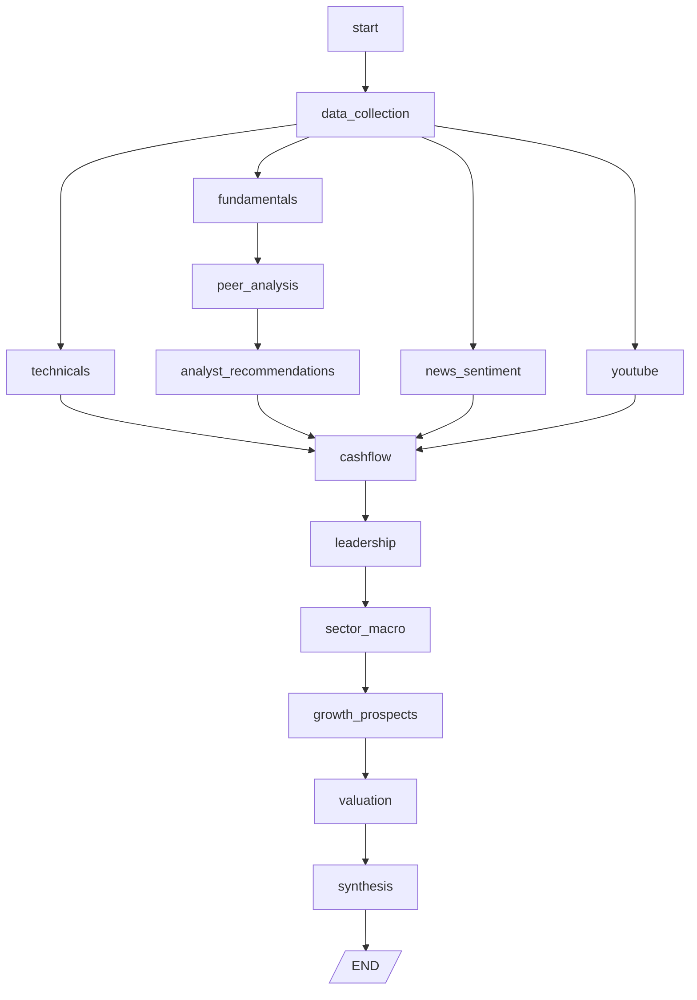

## EquiSight request lifecycle: UI → FastAPI → LangGraph → Recommendation

### Purpose
This document explains, end-to-end, what happens when a user submits a stock analysis request from the UI. It covers the UI workflow, API contract, the actual LangGraph topology in code, which nodes use the LLM (with exact prompts), deterministic scoring, decision mapping, error handling, and how results render in the UI.

## High-level sequence
1. User enters one or more tickers and horizons in the UI, then clicks Analyze.
2. Frontend POSTs JSON to the backend `POST /analyze`.
3. FastAPI validates input, builds LangGraph state, and runs the graph.
4. After data collection, parallel analysis nodes run (Technicals, Fundamentals, News, YouTube).
5. Fundamentals → Peer Analysis → Analyst Recommendations, then Cashflow consumes inputs from Technicals, Analyst Recommendations, News, and YouTube. Then: Leadership → Sector/Macro → Growth Prospects → Valuation.
6. Synthesis merges all evidence (plus a small LLM overlay), applies decision logic, and returns a structured `TickerReport` and Recommendation & Rating to the UI.
7. FastAPI responds; the UI renders summary cards, charts, and tabbed details.

```mermaid
sequenceDiagram
    autonumber
    participant U as UI (React)
    participant A as API (FastAPI)
    participant G as Graph Runner (LangGraph)
    participant D as Data Nodes
    participant S as Synthesis
    U->>A: POST /analyze { tickers, horizons }
    A->>G: build state; execute graph
    G->>D: Start → DataCollection
    par Parallel analyses
        D-->>D: Technicals
        D-->>D: Fundamentals
        D-->>D: NewsSentiment
        D-->>D: YouTubeAnalysis
    end
    D->>D: Fundamentals → PeerAnalysis → AnalystRecommendations
    D->>D: Cashflow (inputs from Technicals, AnalystRecommendations, News, YouTube)
    D->>D: Leadership → SectorMacro → GrowthProspects → Valuation
    D->>S: Aggregated evidence
    S-->>G: Decision + Report
    G-->>A: ResearchResponse
    A-->>U: 200 OK; render
```



## What produces “Recommendation & Rating”
- The `synthesis` node is responsible for the final Recommendation & Rating (Buy/Hold/Sell, numeric rating, stars, letter grade, expected returns, reasons for and against).

Code reference (node registration and terminal edge):
```54:56:/Users/govindak/workspace/EquiSense_AI/agentic-stock-research/app/graph/workflow.py
    # Use simple synthesis (enhanced version has data explosion bug)
    graph.add_node("synthesis", _wrap(synthesis_node, settings))
```

```83:85:/Users/govindak/workspace/EquiSense_AI/agentic-stock-research/app/graph/workflow.py
    graph.add_edge("growth_prospects", "valuation")
    graph.add_edge("valuation", "synthesis")
    graph.add_edge("synthesis", END)
```

## UI flow (frontend)
- Component entry: `Navbar`, `App`
- Input: `TickerInputForm` (tickers, short/long horizons)
- Action: Analyze button triggers `fetch(`${VITE_API_BASE_URL}/analyze`)`
- Loading: `BrandedLoader`
- Error: `ErrorState`
- Success:
  - `ResultSummaryGrid`: recommendation, rating stars, sentiment, cash flow, technical sparkline
  - `TabbedReportViewer`: detailed sections (Overview, Technicals, Fundamentals, Cash Flow, Sentiment, Leadership, Sector/Macro)
  - Charts: `TechnicalChart` uses OHLCV summary; fundamentals charts are planned

## API contract (backend)
- Endpoint: `POST /analyze`
- Request body (minimal example):
```json
{
  "tickers": ["AAPL"],
  "horizon_short_days": 30,
  "horizon_long_days": 365
}
```
- Response (shape):
```json
{
  "reports": [
    {
      "ticker": "AAPL",
      "sections": {
        "technicals": { "summary": "...", "confidence": 0.83, "details": {"rsi": 54.2, "macd": {"hist": []}, "labels": ["..."], "closes": [ ... ]}},
        "fundamentals": { "summary": "...", "confidence": 0.78, "details": {"pe": 22.4, "roe": 29.2, "growth": {}}},
        "cashflow": { "summary": "...", "confidence": 0.81, "details": {"fcf": 6900000000}},
        "leadership": { "summary": "...", "confidence": 0.7 },
        "news_sentiment": { "summary": "...", "confidence": 0.76, "score": 0.21 },
        "youtube_analysis": { "summary": "...", "confidence": 0.72 },
        "sector_macro": { "summary": "...", "confidence": 0.75 }
      },
      "decision": {
        "action": "Buy | Hold | Sell",
        "rating": 3.6,
        "stars": "★★★☆☆",
        "grade": "B-",
        "expected_return_short": 8.5,
        "expected_return_long": 18.2,
        "top_reasons_for": ["..."],
        "top_reasons_against": ["..."]
      },
      "raw_data": { "AAPL": { "ohlcv_summary": {"labels": ["..."], "closes": [ ... ] } } }
    }
  ]
}
```

## Backend architecture (FastAPI + LangGraph)
- `app/main.py`
  - FastAPI app, CORS for dev, mounts static frontend in prod
  - Routes: `POST /analyze`, `GET /health`, `GET /metrics`
  - Calls `build_research_graph()` and executes with initial state
- `app/graph/workflow.py`
  - Declares the graph: nodes, edges, parallelism, and conditional re-runs
- `app/graph/state.py`
  - Shared `ResearchState` (TypedDict); `tickers: Annotated[List[str], operator.add]`
- `app/tools/*.py`
  - Focused, testable utilities (finance, scraping, nlp, technicals, fundamentals, cashflow, leadership, sector_macro, youtube)
- Infra helpers
  - `app/clients/http.py` (httpx AsyncClient w/ retries)
  - `app/cache/*` (in-memory/Redis), `app/db/*` (async SQLAlchemy, `ResearchRun`)
  - `app/logging.py` (structlog JSON logs), `app/config.py` (pydantic-settings)

## LangGraph workflow details (nodes)
Each node returns a dict subset merged into state, with a `summary`, optional `details`, and a `confidence` score. Low confidence (< 0.7) can trigger a targeted re-run before final synthesis.

1) StartNode (`start.py`)
- Input: request body
- Validates tickers/horizons, normalizes symbols (e.g., region suffixes)
- Initializes `state` skeleton

2) DataCollectionNode (`data_collection.py`)
- Pulls OHLCV from `yfinance` via `tools.finance.get_ohlcv`
- Scrapes basic descriptors when feasible (Screener.in, Yahoo, etc.)
- Produces `raw_data[ticker].ohlcv_summary = { labels, closes, last_close, last_volume }`

3) NewsSentimentNode (`news_sentiment.py`)
- Fetches news headlines/articles, filters relevance
- Summarizes and scores sentiment using `transformers` sentiment pipeline
- Prompt sketch:
```text
Summarize market sentiment for {ticker} from these headlines/articles.
Return a brief summary and a sentiment score in [-1, 1].
```

4) YouTubeAnalysisNode (`youtube_analysis.py`)
- Finds credible finance videos; summarizes key theses & sentiment
- Prompt sketch:
```text
From the following finance videos for {ticker}, extract 3 key points and overall sentiment.
```

5) TechnicalAnalysisNode (`technicals.py`)
- Computes SMA/EMA/RSI/MACD/Bollinger/patterns from OHLCV
- Exposes sparkline inputs: `labels`, `closes`
- Prompt sketch (if LLM commentary desired):
```text
Given RSI={rsi}, MACD hist mean={hist_mean}, and SMA/EMA crosses, summarize technical stance.
```

6) FundamentalAnalysisNode (`fundamentals.py`)
- Calculates valuation and quality metrics (PE, PB, ROE/ROIC, growth)
- Peer comparison when available
- Prompt sketch:
```text
Summarize valuation (PE/PB), profitability (ROE/ROIC), and growth metrics for {ticker} with 2-3 bullet insights.
```

7) PeerAnalysisNode (`peer_analysis.py`)
- Benchmarks against peers and derives relative positioning signals.
- Prompt sketch:
```text
Compare {ticker} to peers on valuation, growth, profitability; return 2-3 key relative insights.
```

8) AnalystRecommendationsNode (`analyst_recommendations.py`)
- Aggregates analyst ratings/targets where available; computes consensus indicators.
- Prompt sketch:
```text
Summarize analyst consensus for {ticker}: rating distribution and target dispersion.
```

9) CashflowAnalysisNode (`cashflow.py`)
- Analyzes OCF/FCF/capex trends; stability and coverage
- Prompt sketch:
```text
Assess free cash flow stability and capex trends for {ticker}. Note any inflections.
```

10) LeadershipNode (`leadership.py`)
- Scrapes bios/governance indicators; flags controversies or insider patterns
- Prompt sketch:
```text
Summarize leadership quality and governance risk for {ticker} in 2 bullets.
```

11) SectorMacroNode (`sector_macro.py`)
- Summarizes sector tailwinds/headwinds and macro sensitivities
- Prompt sketch:
```text
Provide sector/macro context affecting {ticker} over the next year.
```

12) GrowthProspectsNode (`growth_prospects.py`)
- Projects growth scenarios across 1Y/3Y/5Y+ using recent trends and sector context.
- Prompt sketch:
```text
Provide short/medium/long-term growth outlook for {ticker} with 2 succinct drivers per horizon.
```

13) ValuationNode (`valuation.py`)
- Computes/collects valuation views (DCF/DDM/comps/SOP) as available; harmonizes to a normalized score.
- Prompt sketch:
```text
Combine valuation approaches into a single normalized valuation score; note model caveats.
```

14) SynthesisNode (`synthesis.py`)
- Inputs: all sections + confidences
- Normalizes scores; applies decision rules to produce: action (Buy/Hold/Sell), rating, grade, stars, expected returns, top reasons for & against
- Prompt sketch (if LLM-assisted):
```text
You are an equity research assistant. Based on the structured inputs (technicals, fundamentals, cash flow, sentiment, leadership, sector/macro),
produce a concise recommendation with:
  - SCORE in [0,1]
  - ACTION (Buy/Hold/Sell)
  - 3 POSITIVES and 3 NEGATIVES as short phrases
  - Expected short/long returns (%)
Return plain text in fixed sections.
```

Note: The codebase contains an enhanced multi-synthesis node (`synthesis_multi.py`), but the active graph uses the simpler `synthesis` due to data explosion concerns. A Langfuse callback may be attached if available (see `build_research_graph`).

## LLM touchpoints and exact prompts
- Aggregated, cross-node LLM usage happens in `synthesis_node`. It constructs a single prompt that embeds outputs from Technicals, Fundamentals, Peer Analysis, Analyst Recommendations, News, YouTube, Cash Flow, Growth Prospects, and Valuation, then calls the local LLM via Ollama.

Prompt construction (excerpt):
```315:363:/Users/govindak/workspace/EquiSense_AI/agentic-stock-research/app/graph/nodes/synthesis.py
    # Use LLM to analyze all data and make investment decision
    analysis_prompt = f"""You are an expert financial analyst. Analyze the following data for {ticker} and provide a comprehensive investment recommendation.

**Technical Analysis:**
{tech if tech else "No technical data available"}

**Fundamentals:**
PE Ratio: {fund.get('pe', 'N/A')}
Price-to-Book: {fund.get('pb', 'N/A')}
ROE: {fund.get('roe', 'N/A')}
Revenue Growth: {fund.get('revenueGrowth', 'N/A')}
Operating Margins: {fund.get('operatingMargins', 'N/A')}

**Peer Analysis:**
{peer.get('summary', 'No peer analysis available')}
Relative Position: {peer.get('relative_position', 'N/A')}

**Analyst Recommendations:**
{analyst.get('summary', 'No analyst data available')}
Consensus: {analyst.get('recommendation_summary', {}).get('consensus', 'N/A')}
Target Price Analysis: {analyst.get('consensus_analysis', {}).get('summary', 'N/A')}

**Sentiment:**
News Score: {news.get('score', 'N/A')} ({news.get('summary', 'No news analysis')})
YouTube Score: {yt.get('score', 'N/A')} ({yt.get('summary', 'No YouTube analysis')})

**Cash Flow:**
{cash if cash else "No cash flow data available"}

**Growth Prospects:**
{growth.get('summary', 'No growth analysis available')}
Overall Outlook: {growth.get('growth_outlook', {}).get('overall_outlook', 'N/A')}

**Valuation:**
{valuation.get('valuation_summary', 'No valuation data available')}

Based on this analysis, provide:
1. Overall score from 0-1 (0=strong sell, 0.5=neutral, 1=strong buy)
2. Investment recommendation (Buy/Hold/Sell)
3. 2-3 key positive factors
4. 2-3 key risk factors
5. Expected return percentage

Format your response as:
SCORE: [0.XX]
ACTION: [Buy/Hold/Sell]
POSITIVES: [factor1], [factor2], [factor3]
NEGATIVES: [risk1], [risk2], [risk3]
RETURN: [X.X]%"""
```

LLM call (Ollama) and preview logging:
```365:373:/Users/govindak/workspace/EquiSense_AI/agentic-stock-research/app/graph/nodes/synthesis.py
    llm_response = await asyncio.to_thread(_ollama, analysis_prompt)
    if llm_response:
        logger.info(f"LLM response length: {len(llm_response)} chars")
        logger.info(f"LLM response preview: {llm_response[:500]}...")
```

Secondary LLM usage: `news_sentiment_node` analyzes individual headlines with a mini prompt:
```21:34:/Users/govindak/workspace/EquiSense_AI/agentic-stock-research/app/graph/nodes/news_sentiment.py
        prompt = f"""Analyze this financial headline for {ticker} and provide:
1. Sentiment classification: Positive, Negative, or Neutral
2. One-line professional rationale (max 8 words)

Headline: "{headline}"

Format your response as:
SENTIMENT: [Positive/Negative/Neutral]
RATIONALE: [brief professional explanation]

Example:
SENTIMENT: Positive
RATIONALE: Strong earnings growth reported"""
```

## Synthesis scoring → Recommendation mapping
The synthesis node merges a deterministic composite score from section metrics with (optionally) a bounded LLM adjustment, then derives the final decision.

Deterministic weighted scoring (technicals, fundamentals, cash flow, peers, analysts):
```193:291:/Users/govindak/workspace/EquiSense_AI/agentic-stock-research/app/graph/nodes/synthesis.py
def _calculate_base_score(analysis: dict) -> float:
    # Technicals 30%, Fundamentals 25%, Cash Flow 20%, Peer 15%, Analysts 10%
    ...
```

Combining with LLM (±0.2 cap) or falling back to the base score:
```494:505:/Users/govindak/workspace/EquiSense_AI/agentic-stock-research/app/graph/nodes/synthesis.py
    base_score = _calculate_base_score(a)
    if llm_parsed and abs(composite_score - 0.5) > 0.1:
        llm_adjustment = max(-0.2, min(0.2, composite_score - base_score))
        composite_score = base_score + llm_adjustment
    else:
        composite_score = base_score
```

Score → Action thresholds:
```13:24:/Users/govindak/workspace/EquiSense_AI/agentic-stock-research/app/graph/nodes/synthesis.py
def _score_to_action(score: float) -> str:
    if score >= 0.85: return "Strong Buy"
    elif score >= 0.70: return "Buy"
    elif score >= 0.55: return "Hold"
    elif score >= 0.40: return "Sell"
    else: return "Strong Sell"
```

Score → Letter grade:
```27:54:/Users/govindak/workspace/EquiSense_AI/agentic-stock-research/app/graph/nodes/synthesis.py
def _score_to_letter_grade(score: float) -> str:  # A+ ... F cutoffs
    ...
```

Score → Stars (out of 5):
```57:72:/Users/govindak/workspace/EquiSense_AI/agentic-stock-research/app/graph/nodes/synthesis.py
def _generate_star_display(score: float) -> str:
    ...
```

Expected return fallback (when LLM parsing fails):
```526:529:/Users/govindak/workspace/EquiSense_AI/agentic-stock-research/app/graph/nodes/synthesis.py
    expected_return = round((composite_score - 0.5) * 40, 1)
```

## Conditional re-runs
- Each node assigns `confidence ∈ [0,1]`.
- If `confidence < 0.7` or required signals are missing, the workflow re-runs that node (and only that node) with adjusted parameters (e.g., broadened sources, extended date ranges) before continuing.

## Mapping results to UI
- `decision.action`, `decision.rating`, `decision.stars`, `decision.grade` → Recommendation card in `ResultSummaryGrid`
- `sections.news_sentiment.summary` and `score` → Sentiment card
- `sections.technicals.details.labels/closes` → `TechnicalChart` sparkline
- `sections.fundamentals.details` (PE/ROE/growth) → Fundamentals card and planned bar charts
- `sections.peer_analysis` and `sections.analyst_recommendations` (if present) → Overview/Details tabs; can be summarized into the Fundamentals card
- `sections.cashflow.details.fcf` (+ timeseries, when available) → Cash flow card
- `sections.growth_prospects` and `sections.valuation` (if present) → Overview/Details tabs; valuation can influence the Recommendation card annotations
- Tabs display each section’s full `summary` and selected `details`

## Error handling and UX
- Backend returns 200 with error payloads when possible (graceful degradation)
- Frontend shows `ErrorState` with retry; analyze button is disabled while running; latency shown
- CORS enabled for local dev; frontend `.env` sets `VITE_API_BASE_URL`

## Performance, caching, and rate limits
- httpx with timeouts/retries; optional Redis cache for expensive calls
- yfinance calls are lightweight; premium provider adapters can replace it
- Transformers pipelines can be pinned and warmed in Docker

## Observability
- Structured logs via `structlog` (JSON)
- Node-level info logs with summaries and confidences
- Optional tracing integration (span warnings are benign in local dev)

## Environments
- Dev: Vite on 5173/5174; FastAPI on 8000; `scripts/dev.sh` runs both
- Prod: Docker build produces frontend; FastAPI serves `frontend/dist`

## Appendix: Minimal examples
Request
```bash
curl -X POST http://localhost:8000/analyze \
  -H 'content-type: application/json' \
  -d '{"tickers":["AAPL"],"horizon_short_days":30,"horizon_long_days":365}'
```

Frontend usage (fetch)
```ts
const base = import.meta.env.VITE_API_BASE_URL || 'http://localhost:8000';
const res = await fetch(`${base}/analyze`, {
  method: 'POST',
  headers: { 'content-type': 'application/json' },
  body: JSON.stringify({ tickers: [ticker], horizon_short_days: 30, horizon_long_days: 365 })
});
```


